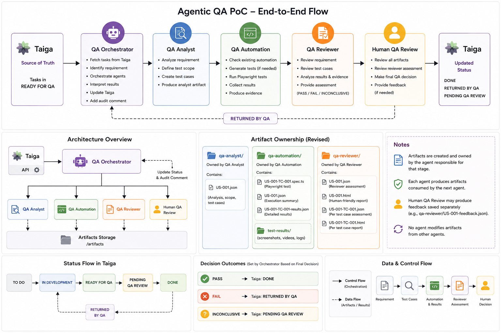

# Agentic QA POC

This repository is an Agentic QA proof of concept. Specialized QA agents take a requirement from a Taiga board, generate Test Cases, generate and execute Playwright automation, review the evidence, and write the QA decision back to Taiga.

Taiga is part of the POC. The demonstration board is:

**https://tree.taiga.io/project/erikatest-poc/taskboard/sprint-0-412**

Access to that Taiga project is required to run the full workflow. Use your own Taiga credentials and your own `LLM_API_KEY`. The repository must never contain real credentials.



## What the POC demonstrates

| Agent | Responsibility |
|-------|----------------|
| **QA Analyst** | Reads a User Story / requirement and produces functional Test Cases. |
| **QA Automation** | Generates Playwright automation from each Test Case, executes the user journey, and classifies **PASSED** or **FAILED** from Test Case-derived validations. |
| **QA Reviewer** | Reviews Analyst and Automation evidence and makes the overall QA decision: **PASS**, **FAIL**, or **INCONCLUSIVE**. |
| **QA Orchestrator** | Discovers Taiga Tasks in **Ready for QA**, runs the agents, and updates Taiga after the Reviewer decision. |

Also demonstrated:

- Playwright user-journey automation, overlay/modal handling, and evidence collection
- Automation **PASSED** / **FAILED** is based on Test Case-derived validations, not merely whether Playwright exited successfully. Automation never returns **INCONCLUSIVE**.
- Reviewer **PASS** / **FAIL** / **INCONCLUSIVE** remains a Reviewer decision.

## High-level flow

```text
Taiga
  → QA Analyst
  → QA Automation
  → Playwright execution
  → QA Reviewer
  → Taiga workflow update
```

1. Put the Task to process in **Ready for QA** on the Taiga board.
2. The Orchestrator discovers Tasks in **Ready for QA** and treats the parent User Story as the requirement.
3. The Analyst writes Test Cases to `test-cases/{requirementId}/{testCaseId}.json`.
4. Automation generates or reuses `tests/{requirementId}/{testCaseId}.spec.ts`, runs Playwright, and writes evidence under `artifacts/`.
5. The Reviewer consumes that evidence and records **PASS**, **FAIL**, or **INCONCLUSIVE**.
6. The Orchestrator adds a QA audit comment, then transitions the Taiga Task according to the Reviewer decision. A Task is never moved without that comment.

If no Task is in **Ready for QA**, the Orchestrator reports that and does not invoke the agents.

## Prerequisites

- Node.js 18 or later
- npm
- Access to the Taiga project: https://tree.taiga.io/project/erikatest-poc/taskboard/sprint-0-412
- Your own Taiga username and password
- Your own LLM API key for an OpenAI-compatible Responses API (`LLM_API_KEY`)

## Installation

```bash
git clone <repository-url>
cd agentic-qa-poc
npm install
npx playwright install chromium
```

Chromium is enough for the POC Playwright runs. Install other browsers only if you need them.

## Environment configuration

Copy the example file and fill in **your** credentials:

```bash
cp .env.example .env
```

Then edit `.env`. Do not commit `.env`. It is local and gitignored.

A successful Taiga login may create `.taiga-auth.json` in the project root. That file is also local and gitignored. Do not commit it.

### Required

| Variable | Meaning |
|----------|---------|
| `LLM_API_KEY` | LLM credentials used by Analyst, Automation generation, and Reviewer. Use your own key. |
| `TAIGA_USERNAME` | Your Taiga Cloud username. |
| `TAIGA_PASSWORD` | Your Taiga Cloud password. |
| `TAIGA_PROJECT_SLUG` | Taiga project slug. For this POC use `erikatest-poc`. |

### Optional

| Variable | Meaning |
|----------|---------|
| `LLM_BASE_URL` | Defaults to `https://api.openai.com/v1`. |
| `LLM_MODEL` | Defaults to `gpt-5-mini`. |
| `TAIGA_BASE_URL` | Defaults to `https://api.taiga.io`. |
| `TAIGA_TOKEN` | Temporary Taiga token fallback if username and password are not used. |
| `TAIGA_AUTH_SCHEME` | Defaults to `Bearer`. |
| `HOMEPAGE` | Optional Playwright application URL override. |
| `BASE_URL` | Optional Playwright application URL override when `HOMEPAGE` is unset. |
| `PORT` | QA Review UI port. Defaults to `3000`. |

## How to run

This is the main POC entry point:

```bash
npx tsx agents/qa-orchestrator/run.ts
```

Before running:

1. Confirm you can open https://tree.taiga.io/project/erikatest-poc/taskboard/sprint-0-412
2. Set `TAIGA_PROJECT_SLUG=erikatest-poc` unless you are pointing at a different project
3. Put the Task you want processed in **Ready for QA**
4. Provide your own `LLM_API_KEY`, `TAIGA_USERNAME`, and `TAIGA_PASSWORD` in `.env`

The Orchestrator:

- loads `.env`
- authenticates to Taiga
- discovers Tasks in **Ready for QA**
- runs Analyst, Automation, and Reviewer as needed
- writes runtime output under `artifacts/`
- adds a QA audit comment
- updates the Taiga Task status from the Reviewer decision

Playwright exercises the live application described by the Test Case (this POC targets Groupon). Network access is required.

## Useful commands

Run one agent after Test Cases or artifacts exist:

```bash
npx tsx agents/qa-analyst/run.ts US-001
npx tsx agents/qa-automation/run.ts US-001 TC-001
npx tsx agents/qa-reviewer/run.ts US-001
```

Standalone Analyst reads local markdown from `requirements/`. The full POC path uses Taiga through the Orchestrator and does not require a `requirements/` folder.

Regression tests (no live Taiga or LLM required):

```bash
npm run test:automation
npm run test:overlay
npm run test:reviewer
npm run test:taiga-auth
```

Optional local Reviewer UI (does not run Playwright or call the LLM):

```bash
npx tsx qa-review-ui/server.ts
```

Reset generated runtime state (does not change Taiga, `.env`, or agent source):

```bash
npx tsx scripts/reset-poc.ts
```

## Project structure

| Path | Role |
|------|------|
| `agents/qa-analyst/` | Test Case generation |
| `agents/qa-automation/` | Playwright generation, execution, and evidence |
| `agents/qa-reviewer/` | QA review decision |
| `agents/qa-orchestrator/` | Taiga discovery and agent coordination |
| `integrations/taiga/` | Taiga client and board adapter |
| `test-cases/` | Persisted Analyst Test Cases |
| `tests/` | Generated or reused Playwright specs |
| `artifacts/` | Runtime Analyst, Automation, Reviewer, and Orchestrator output |
| `qa-review-ui/` | Local human review UI |
| `scripts/reset-poc.ts` | Clears runtime artifacts and generated specs |

`artifacts/` is created at runtime and is not source. `test-cases/` and `tests/` are produced by the pipeline and can be reused on later runs.

## Important notes

- Use the Taiga board: https://tree.taiga.io/project/erikatest-poc/taskboard/sprint-0-412
- The Task to process must be in **Ready for QA**.
- The Reviewer decision determines the Taiga workflow transition. A QA audit comment is added before the Task is moved.
- Automation reports **PASSED** or **FAILED** from Test Case validations. The Reviewer then classifies **PASS**, **FAIL**, or **INCONCLUSIVE** for the board.
- `.env` and `.taiga-auth.json` are local and gitignored. Never commit real credentials.
- Do not reuse another developer's `LLM_API_KEY` or Taiga password.
